# Open Source Vector Mahjong Tiles

A complete 42-piece set of beautifully extracted, pristine colored vector SVGs of classic Mahjong tiles. The computer vision extraction perfectly preserves the authentic hand-carved details, deep shadow valleys, and surface glare highlights of the original physical tiles.

## Standard Tiles

  
  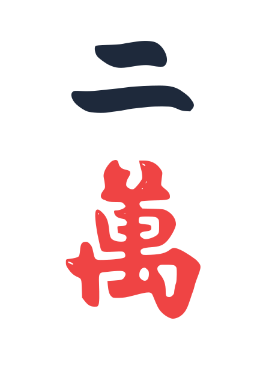
  
  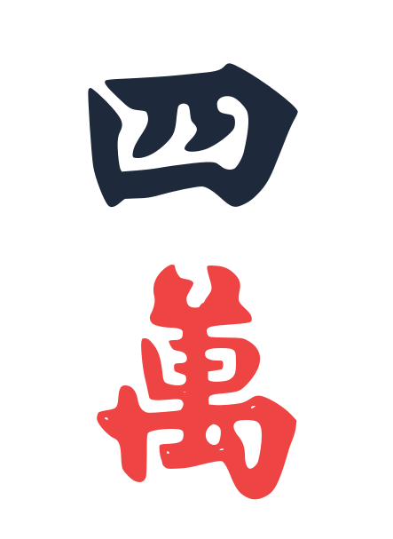
  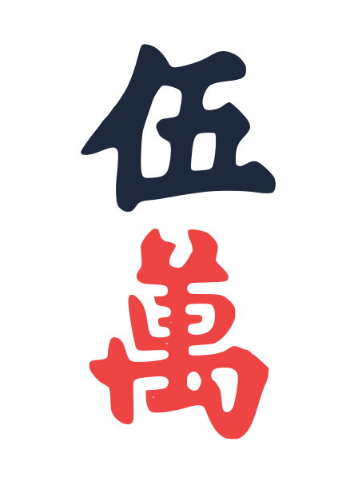
  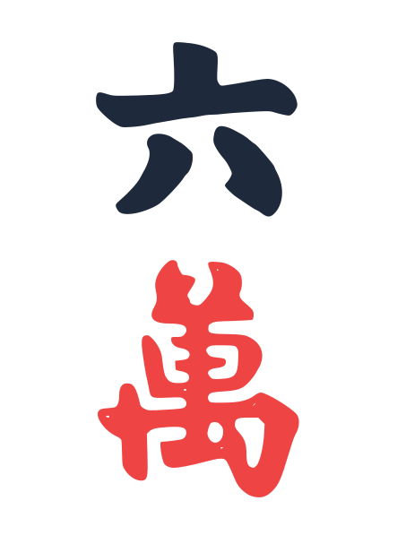
  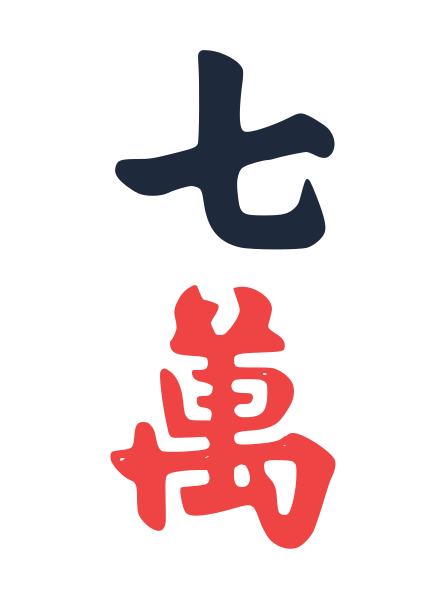
  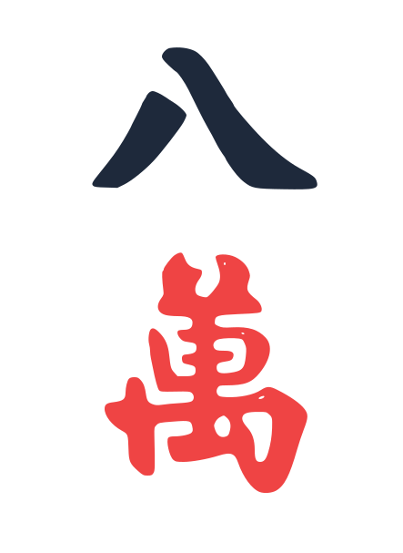
  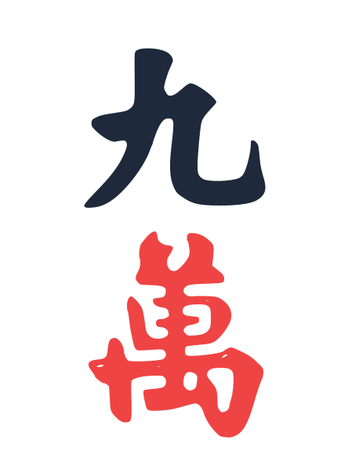
  
  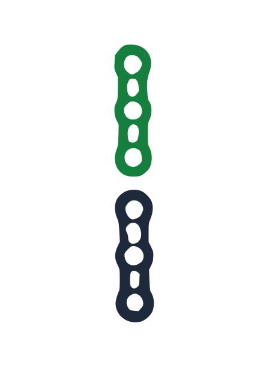
  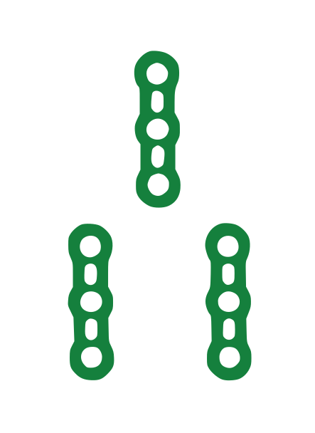
  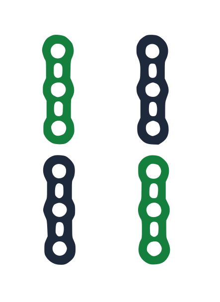
  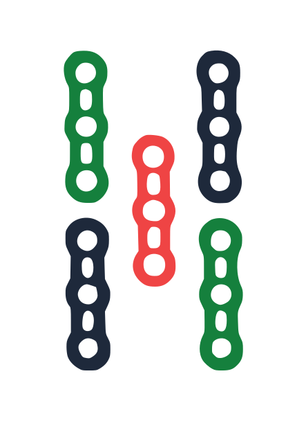
  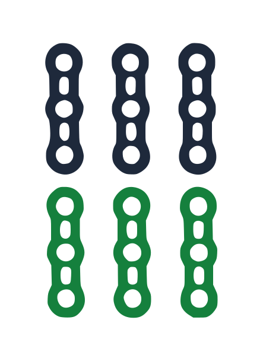
  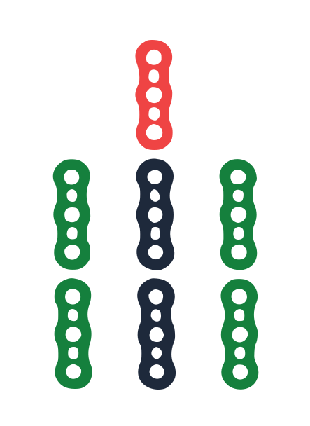
  
  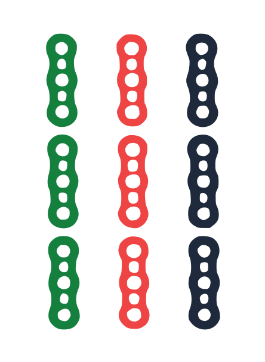
  
  
  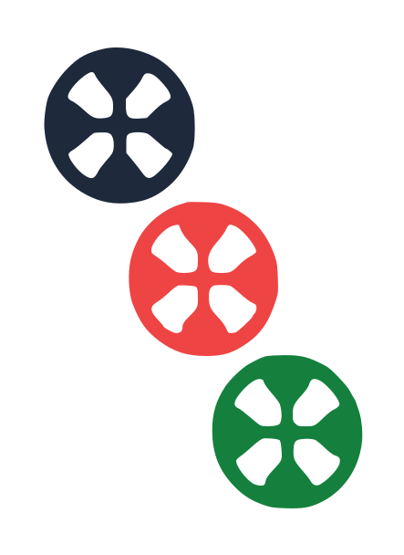
  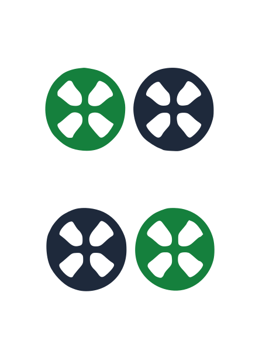
  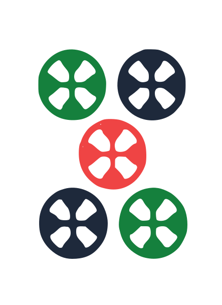
  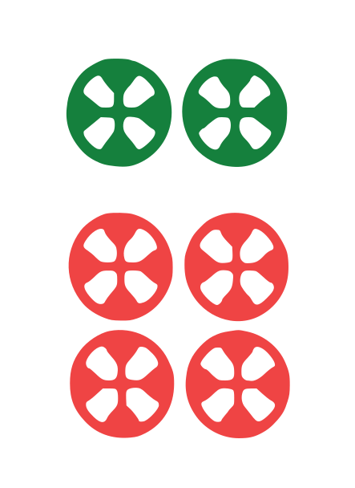
  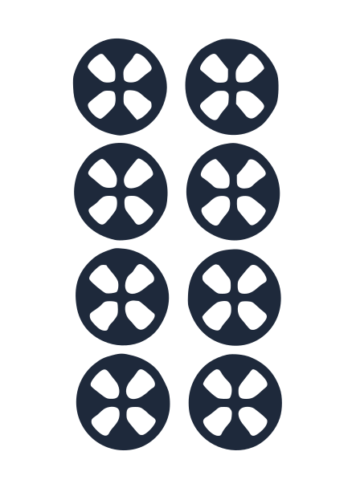
  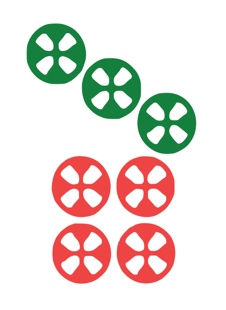
  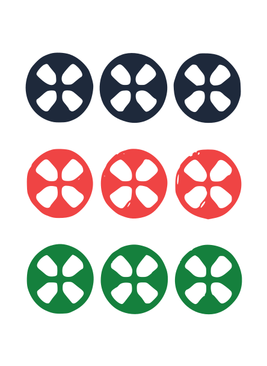
  
  
  
  
  
  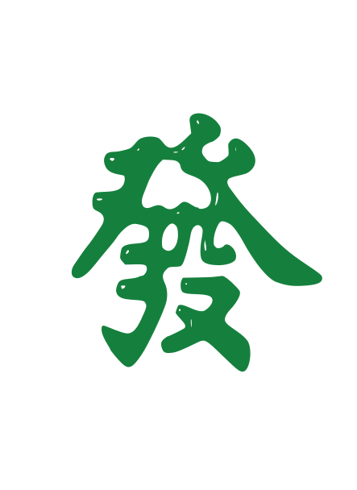
  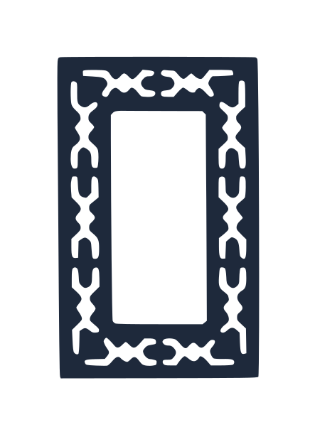

## Flower / Season Tiles

  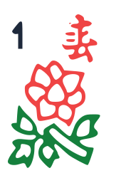
  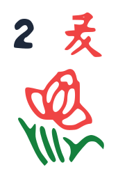
  
  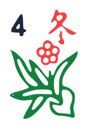
  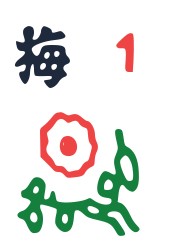
  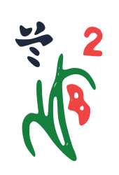
  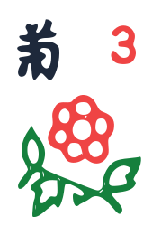
  

